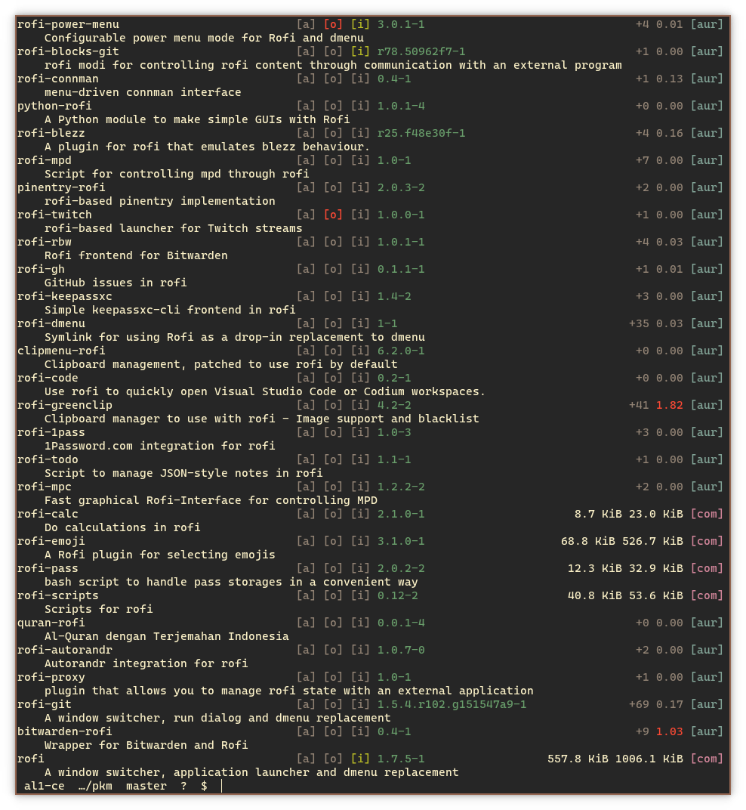
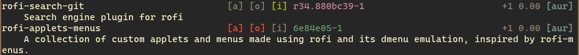
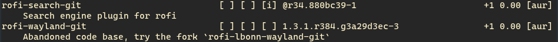
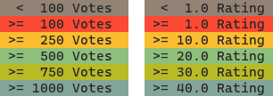

# pkm
**P**ac**K**age**M**anager - Simple apt-style [yay](https://github.com/Jguer/yay) wrapper

<!-- Uncomment when shelds going to add dub score -->
<!-- [](https://aur.archlinux.org/packages/pkm) 
[](https://code.dlang.org/packages/pkm) 
[](https://github.com/al1-ce/pkm)

  -->
<!-- Custom score badge, doesnt really work coz it shows 0.700090412 etc -->
<!--  -->

[](https://aur.archlinux.org/packages/pkm) 
[](https://code.dlang.org/packages/pkm) 
[](https://github.com/al1-ce/pkm)

 


<!--  -->
<!--  -->
<!-- Cool status badge idk. Uncommentt current one -->

<!-- [](https://repology.org/project/pkm/versions) -->

<!--
[](https://repology.org/project/pkm/versions)
-->

## Description

pkm is simple AUR helper intended to be used alongside with yay. It is not trying to be full replacement, but tries to improve and streamline installation/discovery sprocess.

All pkm commands are simply yay commands, wrapped in apt/pamac ux, which are displayed as is except search. Search in pkm is tweaked to have minimal interface and provide better results sorting.



## Installation

### 1. Install [yay](https://github.com/Jguer/yay) and follow [yay first use](https://github.com/Jguer/yay#first-use)

### 2.1 Source
Compilation of this repository requires [dlang](https://dlang.org).

1. Clone [this repo](https://github.com/al1-ce/pkm) and build it with `dub build -b release`
2. Copy created binary `./bin/pkm` to somewhere in your path, for example `~/.local/bin/`

### 2.2 Binary

1. Go to [releases](https://github.com/al1-ce/pkm/releases) and download binary.
2. Copy downloaded binary `pkm` to somewhere in your path, for example `~/.local/bin/`

### 2.3 AUR

1. Install with any package manager of your choice. Assuming you have `yay` install with `yay -Syu pkm`

### 2.4 dub

1. Fetch package with `dub fetch pkm`
2. Build and install into `/usr/bin` with `dub build pkm -b release -c install`

## Commands

pkm commands follow pamac/apt syntax. Installing `pkm install package`, removing `pkm remove package`, etc..

If you want to perform any of following command only on AUR then add `--aur` or `-a` flag to your command.

| Command | Description | yay command | 
| :------ | :---------- | :---------- |
| search | Search for package. | `yay -Ss [terms...]`
| list | List installed packages. | `yay -Q`
| info | Print info about package. | `yay -Qi [packages...]`
| install | Install package. | `yay -S [packages...]`
| remove | Remove package. | `yay -R [packages...]`
| checkupdates | Checks for available updates. | `yay -Qu`
| update | Update repositories. | `yay -Sy [packages...]`
| upgrade | Upgrade installed packages. | `yay -Su [packages...]`
| clean | Clean unneeded dependencies. | `yay -Yc`

## Config

pkm can be configured with config file located at `~/.config/pkm/conf.yaml` or `~/.pkm.yaml`, one at `~` takes prority.

| Name | Type | Description | Default |
| :----| :--- | :---------- | :------ |
| yaypath | string | Custom path to yay binary. | Guessed with `which` |
| yaysearch | bool | Disable custom pkm search. | `false` |
| color | bool | Should search be printed in color. <br> Will not work if `yaysearch` is `true`. | `true` |
| auronly | bool | Should yay search only AUR. | `false` |
| custom | obj[] | Custom commands. | `null` |

Custom commands:
```yaml
custom:
    # command: [args...]
    # args must exclude yay as 
    # pkm will auto-supply it
    # 
    # also args must be split
    # by space, so avoid
    # spaces inside one argument
    # votecool: -Wv "my thing"
    # as it will be split as 
    # ['-Wv', '"my', 'thing"']
    updupg: -Syu
    vote: -Wv
    unvote: -Wu
    gendb: -Y --gendb
    installyay: -S yay
```

Example config:

```yaml
# conf.yaml
yaypath: ~/.local/bin/yay
yaysearch: yes
auronly: yes
custom:
    updupg: -Syu
    vote: -Wv
    unvote: -Wu
```

## How to read search
All available `pkm` commands are calling `yay` with corresponding flags. This is true for search, but pkm also performs special operations to customise and improve yay's search.

Search always follows this schema:

```
package-name  [a] [o] [i] version/installed-version  package-size/votes install-size/popularity [repo]
    description
```




Here's small table to assist you in reading it:

| Field | Meaning | Special notes |
| :- | :- | :- |
| package-name | Name of package. | | 
| [a] | Is package orphaned. | Highlighted in red when true. If color is disabled displayed as [ ]. "A" stands for abandoned. |
| [o] | Is package outdated. | Highlighted in red when true. If color is disabled displayed as [ ]. |
| [i] | Is package installed. | Highlighted in green when true. If color is disabled displayed as [ ]. |
| version | Version of package. | If installed version is different from current verison then field shows installed version hightlighed in light magenta. If color is disabled version diff shown with `@` at start. |
| package-size/votes | See notes. | If package from AUR: Package votes. <br> If package not from AUR: Package size. 
| package-size/votes | See notes. | If package from AUR: Package popularity. <br> If package not from AUR: Installation size. 
| [repo] | Repository of package. | Repository name is cropped to 3 symbols.
| description | Description. | |

If package is from AUR then it's displaying votes/popularity instead of size and votes/popularity are highlighted in this way:



## FAQ

- ### No color anywhere except search
    See [yay faq](https://github.com/Jguer/yay#frequently-asked-questions)

- ### My config
    ```yaml
    # ~/.config/pkm/conf.yaml
    custom:
        updupg: -Syu
        stats: -Ps
        pkgbuild: -Gp
        vote: -Wv
        unvote: -Wu
    ```

### Other AUR helpers/tools
- [yay](https://github.com/Jguer/yay) 
- [paru](https://github.com/morganamilo/paru)
- [aurutils](https://github.com/AladW/aurutils)
- [pikaur](https://github.com/actionless/pikaur)
